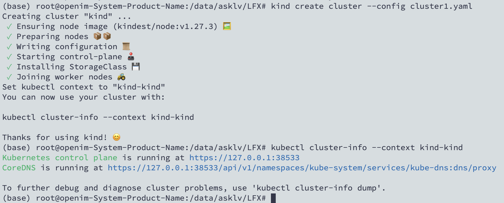
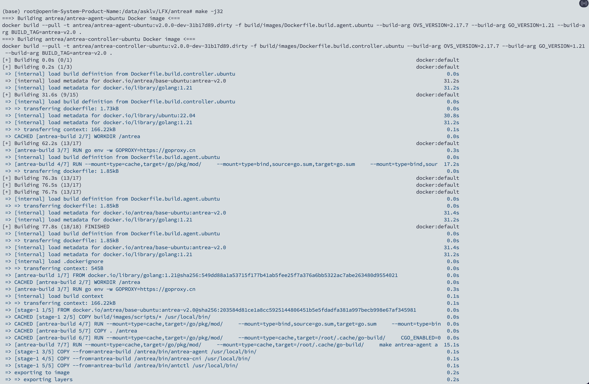
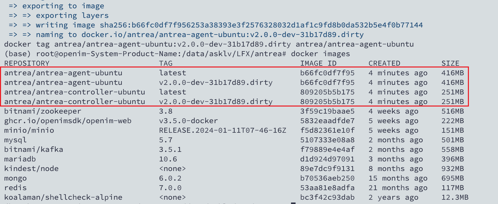
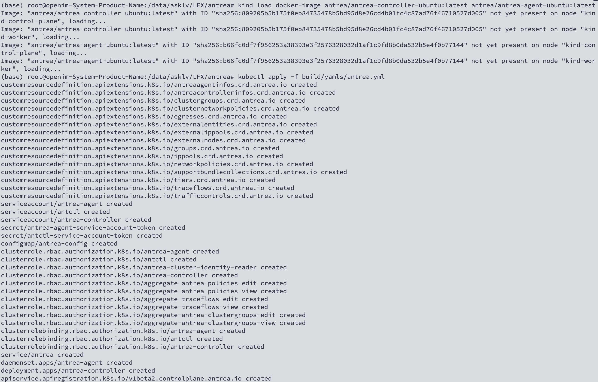
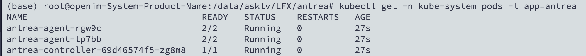
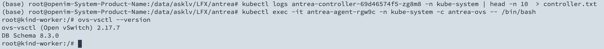
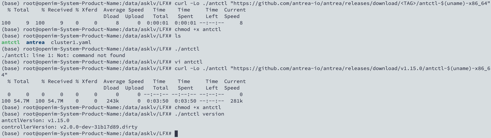

# LFX Mentorship 2024_01 test task

### 1. Create a Kind cluster locally with 1 control-plane Node and 1 worker Node.

Install kind with golang.

```bash
go install sigs.k8s.io/kind@v0.22.0
```

Try to install `kind` and `Docker` in local machine, and use config to start a cluster in kind.

```yaml
kind: Cluster
apiVersion: kind.x-k8s.io/v1alpha4
# One control plane node and one "worker".
nodes:
- role: control-plane
- role: worker
networking:
  # the api server listens on the host
  #apiServerAddress: 0.0.0.0
  # the api server port is 6443
  #apiServerPort: 6443
  # the default CNI will not be installed
  disableDefaultCNI: true
```



**Reference**
- Doc: https://kind.sigs.k8s.io/ 
- Config: https://kind.sigs.k8s.io/docs/user/configuration
- Node config: https://kind.sigs.k8s.io/docs/user/configuration/#nodes
- Net config: https://kind.sigs.k8s.io/docs/user/configuration/#disable-default-cni

### 2. Modify logs in agent and controller

We can find the entrance in agent and controller in `run` function, and add log here.

files are: `antrea/cmd/antrea-agent/agent.go` and `antrea/cmd/antrea-controller/controller.go`

**Reference**
- Client: https://github.com/antrea-io/antrea/tree/main/cmd

### 3. Build Antrea locally with `make` command, then run it

Try to use `make` command to build bin files and generate docker images locally.



Check images from local.



Use `kind load` to load images in local machine, and apply it in cluster.



Then check pods with `kubectl`.



**Reference**
- https://github.com/antrea-io/antrea/blob/main/docs/kind.md#deploy-a-local-build-of-antrea-to-your-kind-cluster-for-developers

### 4. Store logs in local files

Use `kubectl logs` to read logs from each pods, and store them in txt files.

```bash
kubectl logs antrea-agent-tp7bb -n kube-system | head -n 10  > agent1.txt
kubectl logs antrea-agent-rgw9c -n kube-system | head -n 10  > agent2.txt
kubectl logs antrea-controller-69d46574f5-zg8m8 -n kube-system | head -n 10  > controller.txt
```

### 5. Use the `ovs-vsctl` to get ovs version in container

Execute command here.

```bash
kubectl exec -it antrea-agent-rgw9c -n kube-system -c antrea-ovs -- /bin/bash
```



### 6. Download antctl from the Github release assets for the latest Antrea release.


Execute command here.

```bash
curl -Lo ./antctl "https://github.com/antrea-io/antrea/releases/download/v1.15.0/antctl-$(uname)-x86_64"
```

